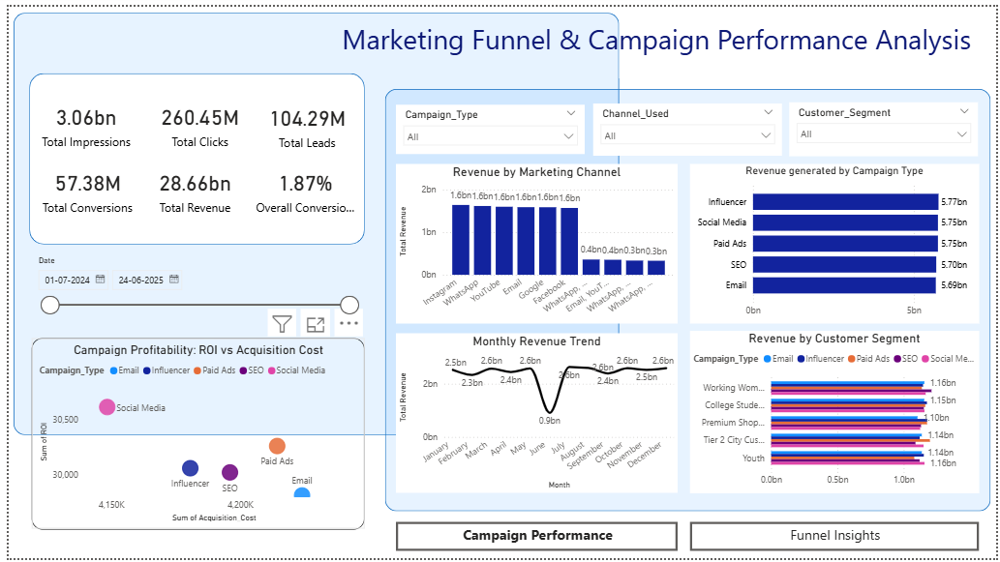
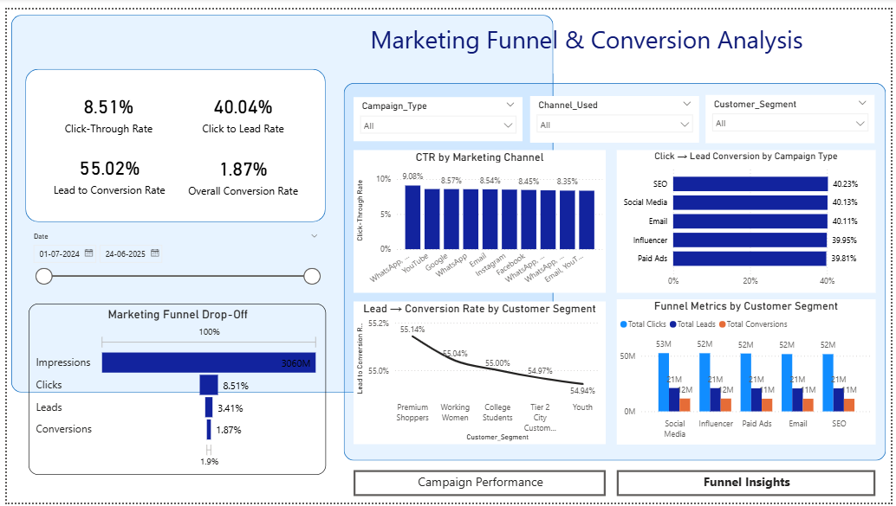

# Marketing Funnel Analysis for Digital Campaigns

## Project Overview
This project analyzes digital marketing campaign performance by examining the complete marketing funnel from impressions to conversions. The goal is to identify drop-offs in the funnel, evaluate campaign effectiveness, and uncover opportunities to improve marketing ROI.

The analysis combines Python-based exploratory data analysis with an interactive Power BI dashboard to provide data-driven marketing insights.

---

## Problem Statement
Marketing teams invest heavily in digital campaigns across multiple channels. However, understanding how users move through the marketing funnel—from seeing an ad to completing a conversion—is essential for optimizing campaign performance and maximizing return on investment.

This project aims to analyze campaign data to identify:
- Major funnel drop-offs
- High-performing campaigns
- Profitable customer segments
- Effective marketing channels

---

## Dataset Description
The dataset contains simulated digital marketing campaign data including key performance metrics such as:

- Impressions
- Clicks
- Leads
- Conversions
- Revenue
- Acquisition Cost
- ROI
- Customer Segment
- Campaign Type
- Marketing Channel

Total Records: **55,555 rows**

---

## Tools & Technologies Used

- Python
- Pandas
- NumPy
- Seaborn
- Matplotlib
- Power BI

---

## Key Analyses Performed

### Marketing Funnel Analysis
Analyzed the user journey through the funnel stages:

Impressions → Clicks → Leads → Conversions

### Campaign Performance Analysis
Evaluated campaign effectiveness across different campaign types.

### Customer Segment Analysis
Identified high-value customer segments driving conversions and revenue.

### Channel Performance Analysis
Compared marketing channels and multi-channel campaigns.

### ROI Optimization
Analyzed the relationship between acquisition cost and return on investment.

---

## Key Insights

- The largest funnel drop-off occurs between **Impressions and Clicks (~8.5% CTR)**.
- **Influencer campaigns generate the highest revenue**.
- **Social media campaigns deliver the highest ROI**.
- **Working Women generate the most revenue**, while **Premium Shoppers have the highest conversion rates**.
- Multi-channel campaigns outperform single-channel strategies.

---

## Power BI Dashboard

An interactive Power BI dashboard was created to visualize marketing performance, including:

- Funnel performance
- Campaign revenue comparison
- ROI analysis
- Customer segment performance
- Channel effectiveness

---

## Dashboard Preview

## Marketing Funnel Analysis

## Campaign Performance

## Campaign Performance

---

